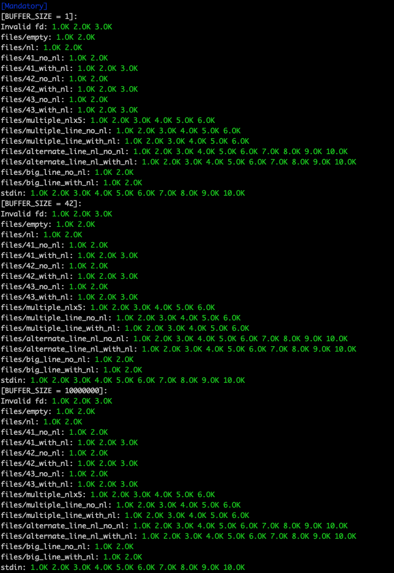

# get_next_line
42 Cursus - Get Next Line


> This project is about programming a function that returns a line read from a file descriptor.

### Content
```diff
- This project is finished but not yet evaluated.
```
- [x] **Extra files**<br>
[teste.txt](teste.txt)
| [result.txt](result.txt)
| [result.diff](result.diff)
| [leaks](leaks)
| [grademe.sh](grademe.sh)
- [x] **Header file**<br>
 [get_next_line.h](get_next_line.h)
- [x] **Main file**<br>
[main.c](main.c)
- [x] **GNL files**<br>
[get_next_line.c](get_next_line.c)
| [utils](get_next_line_utils.c)
- [x] **Bonus files**<br>
[get_next_line_bonus.c](get_next_line_bonus.c)
| [utils](get_next_line_utils_bonus.c)
| [header](get_next_line_bonus.h)

## Test results

Automated test by Tripouille


## 📝 License

This project is licensed. Check out [LICENSE](LICENSE) for more details.

[⬆ Back to the top](#libft)<br>
